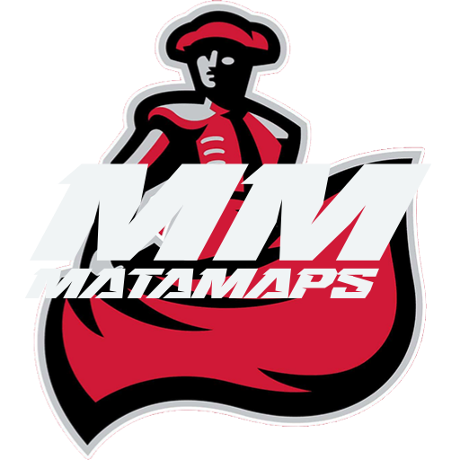
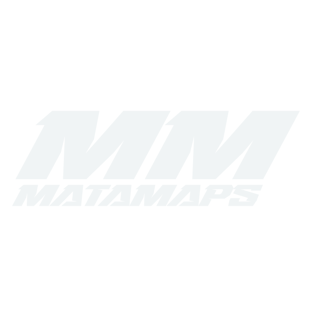

  
  <h3 align="center">CSUN Senior Project 2024/25</h3>
  <h4>Dominic DiBlasio, Sam Mehta, Federico Bailaque, Vinicius Bosque, Srilaya Ponangi</h4>
  

    <b>The central communication platform for CSUN student life to help clubs thrive, for students to connect with personalized events, and to promote accessibility for all opportunities happening on campus!</b>
     
    <h3>About:</h3>
    MataMaps is an all-in-one application designed to empower our students to better engage in clubs, events, accessibility, and campus life all from one interactive application!
     
    Due to an ever-evolving student life on campus, the growth of clubs and on-campus events has fueled a need for a centralized application to facilitate these activities, and to keep them easily accessible to all students.
     
     
    ·
    <a href="https://github.com/dominic-diblasio/matamaps/issues">Our To-Do List!</a>
    ·
    <a href="https://github.com/dominic-diblasio/matamaps/pulls">Active Pull Requests</a>
  

  

